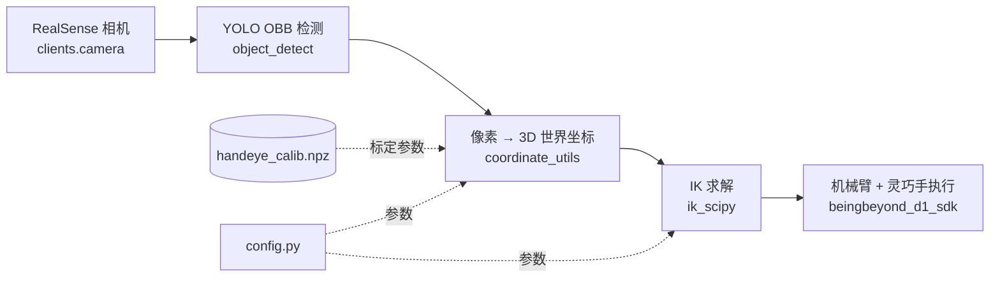
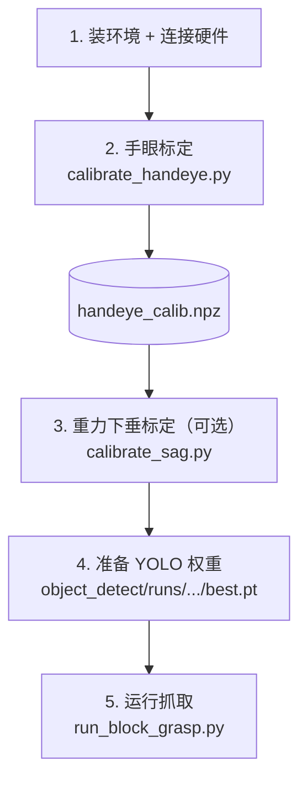

# Block Grasp

基于 YOLO OBB 检测的 D1 灵巧手积木抓取模块，串起 **感知 → 坐标 → 规划 → 执行** 的完整管线：
相机取图 → YOLO 旋转框检测 → 像素到世界坐标转换 → 机械臂 IK → 灵巧手抓取。

## 数据流



## 前置条件

**硬件**

- D1 机械臂（6 关节 + 头部 yaw/pitch），头部固连 RealSense 相机（`TODO`: 确认型号，如 D435i）
- Linker 灵巧手（6 DOF，控制 5 指），CAN 总线连接（默认 `can0`）
- 机械臂串口连接（依赖 `pyserial`）

**软件**

- conda 环境 `bb_d1`
- 外部 SDK：`beingbeyond_d1_sdk`（`head_arm`、`dex_hand`、`pin_kinematics`、`urdf_path`），`TODO`: 安装方式
- 依赖见仓库根 `requirements.txt`（`ultralytics`、`opencv-python`、`pyrealsense2`、`scipy`、`roboticstoolbox-python` 等）
- YOLO OBB 权重：训练产物 `object_detect/runs/train*/weights/best.pt`（运行时自动选取最新的一个）

## 端到端流程



### 快速开始

```bash
conda activate bb_d1
cd ~/Beingbeyond_D1
python block_grasp/run_block_grasp.py             # 手动模式（空格触发抓取）
python block_grasp/run_block_grasp.py --auto      # 自动抓取模式
python block_grasp/run_block_grasp.py --headless  # 无显示窗口
```

常用参数：

| 参数 | 说明 |
| --- | --- |
| `--auto` | 自动抓取，不等待按键 |
| `--headless` | 不开显示窗口 |
| `--model PATH` | 指定 YOLO `.pt` 权重（省略则自动选 `object_detect/runs/` 下最新的 `best.pt`） |
| `--hand-type {right,left}` | 灵巧手左右手，默认 `right` |
| `--hand-can IFACE` | 灵巧手 CAN 接口，默认 `can0` |

运行时窗口内按键：

| 按键 | 作用 |
| --- | --- |
| `SPACE` | 触发一次抓取（手动模式） |
| `A` | 切换自动 / 手动 |
| `R` | 重置堆叠状态 |
| `ESC` / `Q` | 退出 |

**堆叠**：检测到 ≥2 个方块时，以离 `STACK_POSITION` 最近的方块为底座，把另一个方块叠到其正上方，完成后停止；按 `R` 可重置重来。（交互模式按就近选底座；robonix skill 的 `stack_blocks` 还可指定颜色对，把某色叠到某色上。）

> ⚠️ **安全**：真机操作前请确认急停按钮在手边；机械臂会实际运动，注意工作范围内无人无障碍；首次运行建议低速、留足空间观察。

## 标定

抓取**依赖标定结果**，务必先做，且有先后顺序。

| 脚本 | 作用 | 产物 |
| --- | --- | --- |
| `calibrate_handeye.py` | 手眼标定：像素 ↔ 桌面坐标（2D 单应）。交互采点。**必做** | `handeye_calib.npz` |
| `calibrate_sag.py` | 重力下垂补偿标定：移动到已知目标、测量实际到达点，拟合 `dZ = factor × dist³`。**可选**（默认关闭） | 写回 `config.GRAVITY_SAG_FACTOR` |

标定完成后可用 `test_click_goto.py`（点击图像 → 机械臂指尖移动到该点）快速验证坐标链路是否正确。

## 配置（`config.py`）

关键可调参数（按实际场景调整）：

| 参数 | 默认 | 含义 |
| --- | --- | --- |
| `CAM_WIDTH/HEIGHT/FPS` | 1280 / 720 / 30 | 相机分辨率与帧率（命令行参数） |
| `HEAD_YAW_DEG / HEAD_PITCH_DEG` | -10.0 / 35.0 | 相机俯视时的头部 yaw / pitch（度），须与手眼标定时一致 |
| `CONF_THRESHOLD` | 0.85 | YOLO 检测置信度阈值 |
| `IOU_THRESHOLD` | 0.45 | NMS 的 IoU 阈值 |
| `BLOCK_SIZE` | 0.05 | 方块边长（m） |
| `GRASP_Z_OFFSET` | 0.015 | 抓取相对桌面的 Z 偏移（m），需按手指几何调 |
| `GRAVITY_SAG_FACTOR` | 0.3 | 下垂补偿系数（由 `calibrate_sag.py` 标定写回） |
| `INTERP_STEP_SIZE` | 0.025 | 笛卡尔插值步长（m），越大移动越快、轨迹越粗 |
| `CATCH_DELAY_S` | 0.8 | 手部开合后的等待（CAN 总线延时，s） |
| `IK_Z_WEIGHT` | 3.0 | IK 中 Z 轴额外权重（>1 = 优先保证高度） |
| `IK_POS_TOL` | 0.005 | IK 位置容差（m） |
| `IK_MAX_ITERS` | 200 | scipy SLSQP 最大迭代次数 |
| `IK_N_RESTARTS` | 4 | 末端精定位多起点重启次数 |
| `JOINT_JUMP_THR_DEG` | 20.0 | 相邻步单关节最大跳变（度），超限视为近奇异 |
| `HAND_OPEN / HAND_GRASP / HAND_CLOSE` | 见 `config.py` | 手部张开 / 抓取 / 闭合的 6 指位置（归一化 [0,1]，0=开 1=闭） |
| `STACK_POSITION` | `[0.25, 0.0, 0.105]` | 未指定颜色对时，选底座的参考点：离它最近的方块作为底座 |
| `PLACE_POSITIONS` | 见 `config.py` | 按颜色分类（`grasp_block`）的放置位置：每种颜色对应的桌面 x,y |
| `PLACE_DISTANCE_THRESHOLD` | 0.05 | 方块离目标位置小于此距离视为已就位，`grasp_block` 跳过不再抓（m） |
| `NAMED_POSITIONS` | `{"中间": [0.198, 0.107]}` | 命名放置位置，供 `grasp_block` 的 `position` 按名引用 |
| `ASIDE_POSITION` | `[0.20, 0.0, 0.25]` | 让开相机的停靠位；也是分类时颜色无对应位置的兜底落点 |

## IK 说明

抓取使用 **`ik_scipy`**（`scipy.optimize` SLSQP 优化式）：鲁棒（多初值重启）、支持关节限位、把姿态误差分解为 tilt / yaw 并可放松 yaw 权重以提高求解成功率。移动采用笛卡尔直线插值，每步求解并做重力下垂补偿，末端再做一次多起点精定位；每段移动结束都会等待机械臂真正到位，避免读到滞后位姿。

> 说明：`beingbeyond_d1_sdk.pin_kinematics.D1Kinematics` 在本模块中用于正运动学（`fk`），逆解由 `ik_scipy` 完成。

## 脚本一览

### 核心流程

| 文件 | 作用 |
| --- | --- |
| `run_block_grasp.py` | 入口脚本，解析参数、加载模型、驱动 `BlockGraspController`。 |
| `grasp_controller.py` | 抓取控制器（核心，~1060 行）。`BlockGraspController` 编排检测→坐标转换→IK→手部动作；`BlockDetection` 描述单个检测结果。 |
| `config.py` | 抓取配置常量（见上）。 |
| `coordinate_utils.py` | 坐标换算：像素 ↔ 3D。`pixel_to_camera_3d`、`camera_to_base_3d`、`pixel_to_world_2d`、`obb_bottom_center`、`estimate_grasp_angle_deg`。 |
| `__init__.py` | 包初始化与模块说明。 |

### 逆运动学

| 文件 | 作用 |
| --- | --- |
| `ik_scipy.py` | scipy SLSQP 优化式 IK（唯一生产求解器）。`scipy_ik`、`scipy_ik_multi_restart`。 |

### 标定

| 文件 | 作用 |
| --- | --- |
| `calibrate_handeye.py` | 手眼标定，生成 `handeye_calib.npz`。 |
| `calibrate_sag.py` | 重力下垂补偿标定。 |

### 调试脚本

均为可独立运行的手动调试工具，不被其他模块导入。

| 文件 | 作用 |
| --- | --- |
| `test_click_goto.py` | 点击图像 → 机械臂把指尖移到该位置（scipy IK）。 |
| `test_calib.py` | 点击图像 → 打印该像素经单应算出的世界坐标（先把头设到标定姿态），验证标定是否正确。 |
| `test_detect_fixed.py` | 相机 + 头部控制 + YOLO 检测 + 数据采集（BGR 修正版）。 |
| `test_detect_image.py` | 离线检测：对现有图片跑 YOLO OBB，圈出方块并标注颜色。 |
| `test_ee_teleop.py` | 简易末端遥操：手掌朝下，WASD 沿桌面平移（键盘控制）。 |
| `test_move_to_xyz.py` | 输入 `x y z` → 机械臂将指尖移到该点，空行退出。 |

## 故障排查

| 现象 | 排查方向 |
| --- | --- |
| 检测不到方块 | 确认 YOLO 权重路径正确、光照充足；调低 `CONF_THRESHOLD` |
| 抓取位置整体偏移 | 重做 `calibrate_handeye.py`；检查头部姿态是否为 `HEAD_YAW_DEG` / `HEAD_PITCH_DEG` |
| 抓取偏高/偏低 | 调 `GRASP_Z_OFFSET`；远处偏低可启用 `calibrate_sag.py` 的下垂补偿 |
| IK 报无解 / 不动 | 目标可能超出工作空间或关节限位；换抓取角度或把物体挪近 |
| 关节突然大幅跳动被拦截 | 触发 `JOINT_JUMP_THR_DEG` 保护，检查 IK 解是否连续 |
